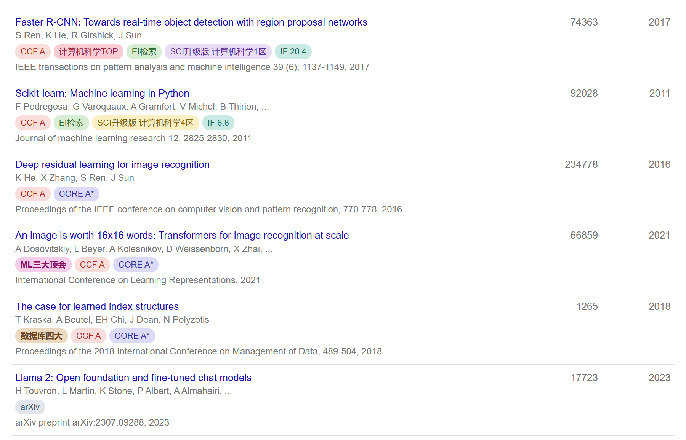

# 学术分级标注 · Scholar Rank

**打开 Google Scholar，每篇论文下面直接标出期刊和会议的级别。**

示意图中的论文均为真实论文，被引次数取自 Semantic Scholar（2026-07-28）

## 这是什么

看别人（或者自己）的 Google Scholar 主页时，一眼分不清哪篇是顶会顶刊、哪篇是水刊。
这个扩展会在每篇论文的作者行下面插一排徽章，把级别直接标出来：

| 徽章 | 含义 |
| --- | --- |
| `ML三大顶会` `数据库四大` | 自定义标记，命中后排在最前面，可自己增删 |
| `CCF A/B/C` | CCF 推荐国际学术会议和期刊目录（第七版，2026） |
| `CORE A*/A/B/C` | 澳大利亚 CORE 会议分级（ICORE2026） |
| `计算机科学TOP` | 中科院分区表升级版的 TOP 期刊 |
| `EI检索` | 被 EI Compendex 收录 |
| `SCI升级版 计算机科学1区` | 中科院分区表升级版的大类分区 |
| `IF 8.7` | JCR 影响因子（另可开启 JCR 分区 Q1–Q4） |
| `预警 论文工厂` | 中科院国际期刊预警名单 |
| `arXiv` `bioRxiv` | 预印本，提示这篇还没经过同行评审 |

鼠标悬停在徽章上能看到完整信息：会议全称、所属领域、小类分区、收录库等。
预印本会标出所在平台（arXiv / bioRxiv / medRxiv / SSRN …）但不参与分级；学位论文、专利则直接跳过。

**个人主页、搜索结果页、引用列表、相关文章、单篇论文详情浮层都会标注**，
翻页或点「显示更多」新加载的条目会自动补上。

几个特点：

- **全离线**。所有数据都打包在扩展里，不联网、不上传任何浏览数据，也不需要注册或 API Key。
- **匹配够扎实**。Google Scholar 的出处写法极不统一（`Journal of machine learning research 12, 2825-2830`、
  `ICASSP 2015-2015 IEEE International Conference on Acoustics, Speech and …`、
  `Proceedings of the ACM on Management of Data`），扩展会剥掉卷期页码和各种前后缀再匹配，
  被 Scholar 截断的出处也能认出来；实在拿不准时宁可不显示，也不瞎标。
- **外观可选**。6 种风格（柔和填充 / 描边 / 实心 / 极简文字 / 方角标签 / 低调灰阶），
  每种徽章都能单独开关，字号可调。

## 安装

还没上架应用商店，用开发者模式加载，一分钟搞定：

1. **下载并解压**——点仓库右上角绿色的 `Code → Download ZIP`，解压出一个文件夹。

2. **打开扩展管理页**——Chrome 是 `chrome://extensions/`，Edge 是 `edge://extensions/`。

3. **打开右上角的「开发者模式」开关**（不打开的话拖进去没反应）。

4. **把解压出来的文件夹直接拖到这个页面上**，松手即安装完成。

5. 打开任意 Google Scholar 页面，例如个人主页 `scholar.google.com/citations?user=XXXX`
   或搜索结果页，徽章会自动出现。

> [!TIP]
> - **要拖文件夹，不是拖 ZIP。** 浏览器只认解压后的目录，压缩包拖进去不会有反应。
> - 拖进去的那一层必须**直接包含 `manifest.json`**。GitHub 的 ZIP 解压后一般是
>   `scholar-rank-main/`，拖它就对了；如果解压出来还套了一层，就往里进一层再拖。
> - 数据文件已经随仓库提供，**装完即用**，不需要执行任何构建命令。
> - 装好后别删掉这个文件夹，浏览器是直接从原地加载的。以后更新代码，回到扩展管理页
>   点一下卡片上的刷新按钮即可。

习惯命令行的话，`git clone` 下来再拖同一个文件夹也行。

支持 `scholar.google.*` 的常见国家域名，以及 `xueshu.lanfanshu.cn`、`sc.panda985.com` 等常用镜像。

## 设置

点击浏览器工具栏上的扩展图标可以快速开关、切换外观风格；点「打开设置」进入完整设置页，
可以逐个开关徽章、调整字号、查看当前打包的数据版本。

设置页还带一个**匹配自测**框：把 Scholar 上的出处原文粘进去，立刻能看到它命中了哪条记录、
走的是哪条匹配路径——遇到没标上的论文，用这个排查最快。

## 数据来源

| 数据 | 来源 |
| --- | --- |
| CCF 推荐目录 2026（第七版） | [ccf.atom.im](https://ccf.atom.im/) ｜ [官方原文](https://www.ccf.org.cn/Academic_Evaluation/By_category/) |
| CORE Conference Rankings（ICORE2026） | [portal.core.edu.au](https://portal.core.edu.au/conf-ranks/) |
| 中科院分区表升级版 2025、JCR 2025、国际期刊预警名单 2025 | [hitfyd/ShowJCR](https://github.com/hitfyd/ShowJCR) |
| EI Compendex Source List | [HiddenStrawberry/EI-COMPENDEX-SOURCE-LIST](https://github.com/HiddenStrawberry/EI-COMPENDEX-SOURCE-LIST) |

感谢以上项目的整理工作。分区与影响因子数据归各自版权方所有，本项目只做离线聚合与展示。

⚠️ 匹配基于刊名字符串，个别同名、改名、新刊可能匹配不到或匹配错；EI 目录是目前公开可得的最新完整版本（2019），
只能当参考。**用于职称评定、学位审核等正式场合时，请务必以官方发布为准并自行核对。**

## 参与贡献

发现某篇论文没标上、标错了，或者想加新的分级体系、新的自定义标记，都非常欢迎：

- 🐛 [提 Issue](../../issues) —— 请把 Scholar 上那条**出处原文**贴上（设置页的「匹配自测」框里可以直接复制），
  这样最容易定位问题。
- 🔧 [提 PR](../../pulls) —— 补别名、加标记分组、修 Bug、加新网站支持都欢迎。
  大部分漏标只要往 `src/data/aliases.json` 补一行就能修好，不用动代码；
  仓库带了 62 项回归测试，改完跑一下 `npm test` 即可。细节见
  [开发说明](docs/DEVELOPMENT.md)。

如果觉得好用，点个 ⭐ 就是最大的支持。
